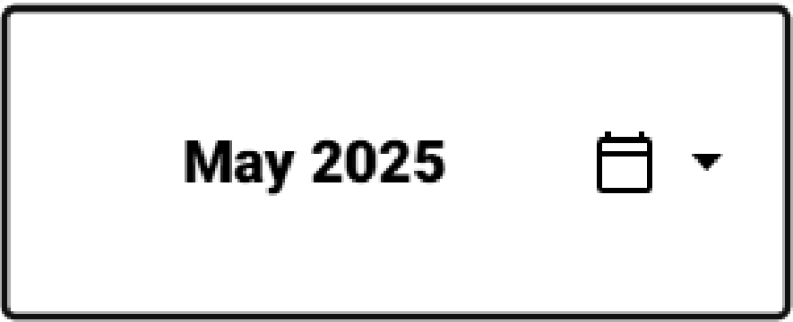
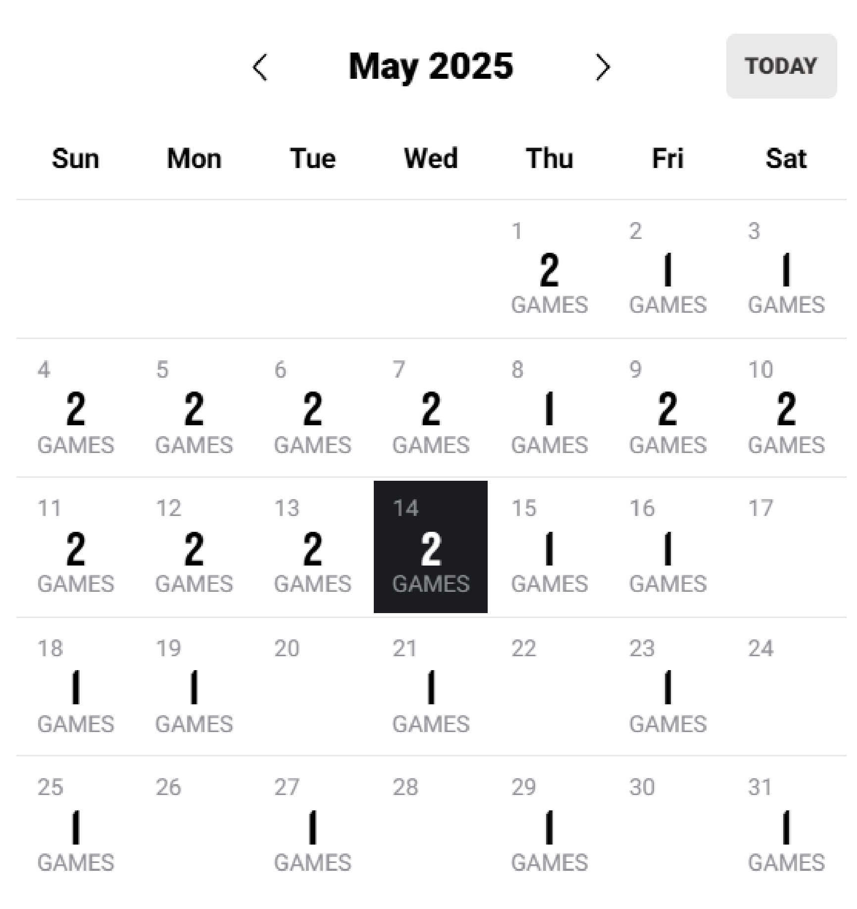
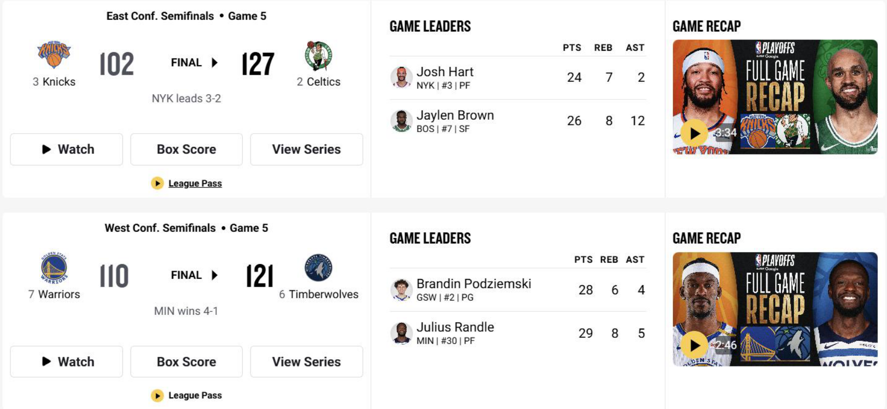
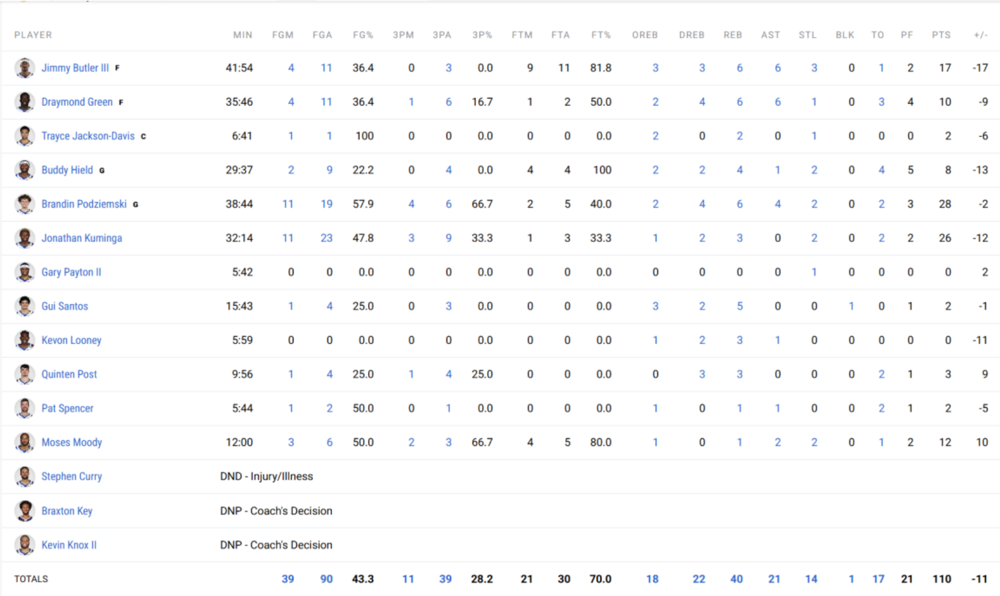

1. 比賽結果在網頁左上方”Games”。

2. 進入”Games”之後左側有一個地方可以點，點進去可以選擇日期。

3. 選擇日期的畫面點進去可以選擇日期，並且有一個”TODAY”可以點就會直接

到今天。

4. 進入選擇好的日期之後，有當天所有的比賽結果可以選擇。也可以藉由點

選”Box Score”來查看比賽球員數據。

5. 進入”Box Score”可以看到場的球員表現，往下滑可以看到另一球隊的球員

數據。

